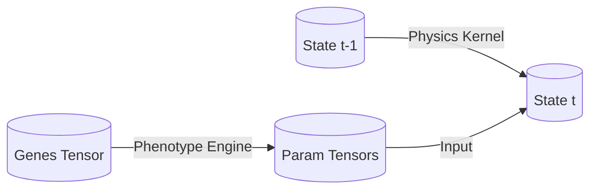

# Evolimo Architecture Concepts

本プロジェクトは、Rust + Candle (テンソル計算フレームワーク) を用いた生物進化シミュレーターである。
パフォーマンスと開発体験を両立させるため、**TypeScriptによる定義からRustコードを自動生成する (Configuration as Code)** アーキテクチャを採用する。

## 1. Directory Structure

Monorepo構成を採用し、定義(Model)と実装(Simulator)を分離する。

```text
root/
├── domain-model/           # TypeScriptによる物理法則・生物仕様の定義 (SSOT)
│   ├── src/
│   │   ├── definitions.ts  # パラメータ、物理演算ルールの記述
│   │   └── builder.ts      # DSL実装
│   ├── scripts/            # TS -> JSON コンパイラ
│   └── _gen/               # 自動生成される中間定義ファイル (JSON)
│
├── simulator/              # Rustによるシミュレーションエンジン
│   ├── build.rs            # ビルド時にJSONを読み込みRustコードを生成
│   ├── src/
│   │   ├── _gen_physics.rs   # [自動生成] 物理演算ロジック
│   │   ├── _gen_phenotype.rs # [自動生成] NN構造定義
│   │   ├── kernel.rs         # Physics Kernelの手書き部分
│   │   ├── lifecycle.rs      # 個体の増減管理
│   │   └── main.rs
│   └── Cargo.toml
│
└── visualizer/             # (Future Work) 可視化用
    └── .gitkeep
```

## 2. Core Architecture

### Data Pipeline

TypeScriptで記述された定義が「唯一の正解 (Single Source of Truth)」となり、そこから全ての計算ロジックが生成される。

1.  **Define (TS):** 物理法則、パラメータ、遺伝子発現ルールを定義。
2.  **Compile (TS -> JSON):** 定義を解析し、中間表現 (IR) である JSON を出力。
3.  **Generate (Rust build.rs):** `cargo build` 時に JSON を読み込み、最適化された Rust コードを生成。
4.  **Run (Rust Binary):** コンパイル済みの静的な計算グラフとして高速に実行。

### Runtime Data Flow

全てのデータは `(個体数 N, 特徴量 D)` の **2階テンソル** として扱われる。



## 3. Component Specifications

### A. Phenotype Engine (遺伝子発現層)

遺伝子から個体の物理パラメータを生成するニューラルネットワーク。

  * **自動生成対象:** ネットワーク構造 (`struct PhenotypeEngine`)、各出力層のサイズ。
  * **Chunking Output:** 出力は単一のテンソルではなく、**アクティベーション関数ごとにグループ化された構造体**として出力される。
      * **Attributes Group:** `Softmax` (合計1.0)。リソース配分（攻撃・防御・速度のバランス等）に使用。
      * **Physics Group:** `Tanh` (-1.0 ~ 1.0)。物理定数、係数に使用。
      * **Traits Group:** `Sigmoid` (0.0 ~ 1.0)。確率、スイッチ特性に使用。

### B. Physics Kernel (物理演算層)

個体の状態を更新する計算エンジン。

  * **自動生成対象:** 物理更新関数 (`update_physics`)。
  * **Zero Copy Integration:** Phenotype Engine の出力（構造体中の各テンソル）は、結合されることなくそのまま Physics Kernel の引数として渡される。
  * **Flattened Parameters:** ベクトルデータも計算グラフ上では `float` の列（Column）としてフラットに展開され、高速な行列演算として処理される。

### C. Lifecycle Manager

  * **役割:** テンソルの行（個体）の増減（誕生、死亡、交配）を管理。
  * **処理:** 計算コストの高いため、毎フレームではなく一定間隔またはイベント駆動で実行。

## 4. Development Workflow

1.  **定義の変更:**
    `domain-model` でパラメータの追加や物理式の変更を行う。
2.  **中間生成:**
    `npm run build` (in domain-model) -> `_gen/physics_ir.json` 等が更新される。
3.  **シミュレータービルド:**
    `cargo build` (in simulator) -> `build.rs` が JSON の変更を検知し、`_gen_xxx.rs` を再生成してコンパイル。

## 5. Technical Decisions

  * **1 Parameter = 1 Float Column:**
    計算効率最大化のため、すべてのパラメータはテンソルの1列としてマッピングされる。インデックス管理は自動生成コードが隠蔽する。
  * **Compile-time Graph Resolution:**
    計算グラフの走査（Traversing）は TS 実行時および Rust ビルド時に完了させる。Runtime では if 分岐のない一直線の命令列として実行される。
  * **Rust Struct in build.rs:**
    JSON スキーマのバリデーションには `serde` を用いた Rust 構造体を使用するが、これは `build.rs` 内部でのみ使用し、自動生成ツール等は導入しない。
